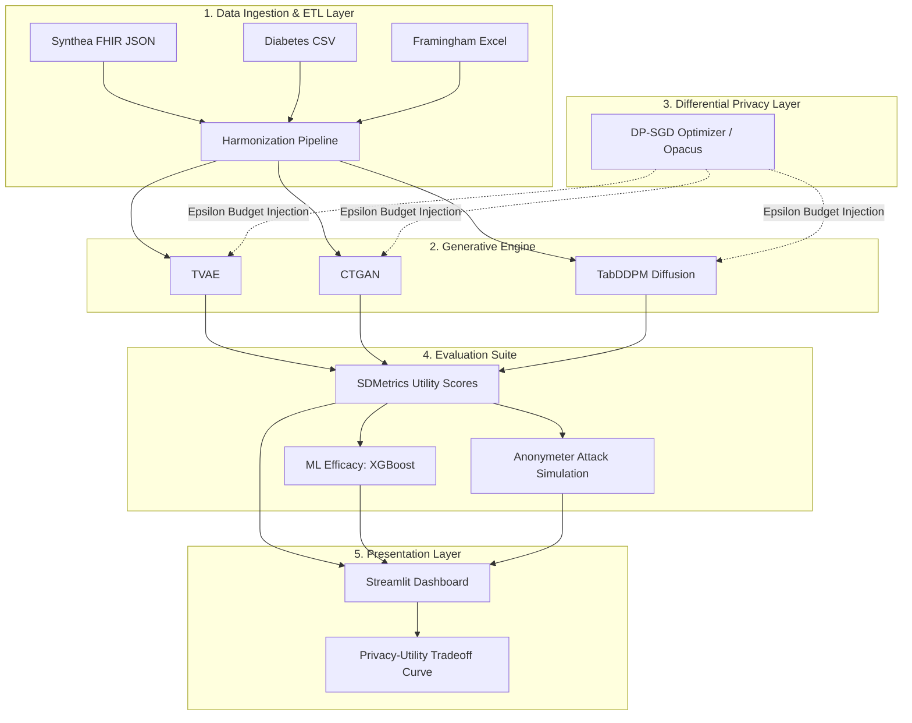

# SynthoGen AI: System Architecture & Pipeline

## High-Level Architecture
SynthoGen AI is designed as a **Comprehensive Generative AI & Privacy Benchmarking Platform**. Instead of just generating synthetic data, the architecture evaluates *how different state-of-the-art generative models react to strict mathematical privacy constraints* across diverse clinical datasets.

---

## The 5-Stage Pipeline

### Stage 1: Multi-Domain Data Ingestion
The pipeline dynamically processes three distinct types of clinical data to prove generalizability:
1. **Longitudinal EHR Data**: Parses deeply nested FHIR JSON bundles (Synthea) into flat tabular structures.
2. **Cardiovascular Epidemiology**: Cleans cleanly structured, low-noise datasets (Framingham).
3. **Metabolic Clinical Profiles**: Handles high-dimensional, heavily missing data requiring intelligent imputation (Diabetes).

### Stage 2: Multi-Model Generation
To benchmark architectures, the data flows into three distinct generative models:
- **TVAE (Variational Autoencoder)**: Excellent at continuous distributions; acts as the baseline.
- **CTGAN (Conditional GAN)**: Specifically designed to handle highly imbalanced categorical variables in clinical data.
- **TabDDPM (Tabular Diffusion)**: State-of-the-art Gaussian diffusion process adapted for tabular clinical data, offering the highest baseline fidelity.

### Stage 3: Differential Privacy Injection (DP-SGD)
This is the core differentiator. We wrap the PyTorch optimizers of the generative models using **Opacus**. By clipping gradients and injecting calibrated Gaussian noise during backpropagation, we enforce ($\epsilon$, $\delta$)-Differential Privacy. The user can adjust the $\epsilon$ budget dynamically.

### Stage 4: The 3-Pillar Evaluation Framework
Generated datasets are strictly evaluated against the original real data:
1. **Distributional Utility**: SDMetrics computes Kolmogorov-Smirnov tests and correlation matrices to ensure the "fake" data looks mathematically real.
2. **ML Efficacy**: We train an XGBoost classifier on the *synthetic* data and test it on a holdout set of *real* data. We track the drop in $F1$ Score and Accuracy.
3. **Empirical Privacy**: We use **Anonymeter** to launch simulated cyberattacks against the dataset, explicitly calculating the risk of Singling-out, Linkability, and Inference attacks.

### Stage 5: The Interactive Dashboard (UI)
A Streamlit interface where researchers can select a Dataset, a Model, and a Privacy Budget ($\epsilon$). The dashboard outputs a **Privacy-Utility Tradeoff Curve**, visually proving that as mathematical privacy increases (lower $\epsilon$), ML Efficacy inherently decreases, providing an honest, transparent benchmark for medical AI research.
